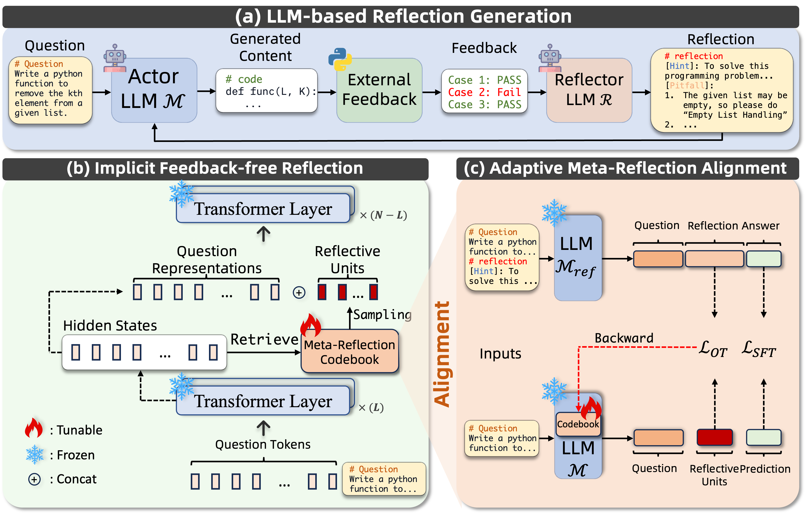

# Meta-Reflection

## Overview
we propose Meta-Reflection, a novel feedback-free reflection mechanism that necessitates only a single inference pass without external feedback.



## Requirements

The core packages are as below:

* numpy==1.26.4
* torch==2.1.0+cu118
* transformers==4.44.2
* peft==0.12.0

## Running Commands
We use **mathematical reasoning** as an example to show the running commands.
### Reflection Generation

```
mkdir datasets
```
```
CUDA_VISIBLE_DEVICES=0 python reflect.py --max_iters 4 --task math --actor_checkpoint meta-llama/Meta-Llama-3.1-8B-Instruct --reflector_checkpoint Qwen/Qwen2-72B-Instruct --sample-input-file benchmark/math/train.jsonl --sample-output-file datasets/llama3_math_dataset.jsonl
```

### Optimization of Meta-Reflection
```
mkdir saves/llama3/math
```
```
CUDA_VISIBLE_DEVICES=0 python train.py -model llama3 -dtype fp16 -codebook_size 1024 -select_len 32 -inserted_layer 27 -lr1 1e-4 -lr2 5e-5 -batch_size 8 -gradient_accumulation_steps 4 -epochs1 2 -epochs2 3 -source_file datasets/llama3_math_dataset.jsonl -save_path saves/llama3/math/layer_27_selectlen_32_size_1024
```

### Evaluation of Meta-Reflection
```
CUDA_VISIBLE_DEVICES=0 python evaluate.py -c saves/llama3/math/layer_27_selectlen_32_size_1024 -f benchmark/math/test.jsonl -o math.jsonl -dtype fp16 -model llama3 -t math
```